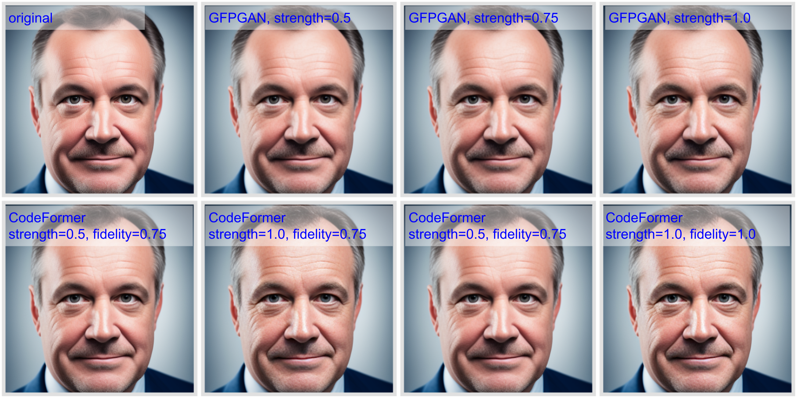

# :material-image-edit: Postprocessing

## Intro

This extension provides the ability to restore faces and upscale images.

## Face Fixing

The default face restoration module is GFPGAN. The default upscale is
Real-ESRGAN. For an alternative face restoration module, see
[CodeFormer Support](#codeformer-support) below.

As of version 1.14, environment.yaml will install the Real-ESRGAN package into
the standard install location for python packages, and will put GFPGAN into a
subdirectory of "src" in the InvokeAI directory. Upscaling with Real-ESRGAN
should "just work" without further intervention. Simply indicate the desired scale on
the popup in the Web GUI.

**GFPGAN** requires a series of downloadable model files to work. These are
loaded when you run `invokeai-configure`. If GFPAN is failing with an
error, please run the following from the InvokeAI directory:

```bash
invokeai-configure
```

If you do not run this script in advance, the GFPGAN module will attempt to
download the models files the first time you try to perform facial
reconstruction.

### Upscaling

Open the upscaling dialog by clicking on the "expand" icon located
above the image display area in the Web UI:

<figure markdown>

</figure>

There are three different upscaling parameters that you can
adjust. The first is the scale itself, either 2x or 4x.

The second is the "Denoising Strength." Higher values will smooth out
the image and remove digital chatter, but may lose fine detail at
higher values.

Third, "Upscale Strength" allows you to adjust how the You can set the
scaling stength between `0` and `1.0` to control the intensity of the
scaling. AI upscalers generally tend to smooth out texture details. If
you wish to retain some of those for natural looking results, we
recommend using values between `0.5 to 0.8`.

[This figure](../assets/features/upscaling-montage.png) illustrates
the effects of denoising and strength. The original image was 512x512,
4x scaled to 2048x2048. The "original" version on the upper left was
scaled using simple pixel averaging. The remainder use the ESRGAN
upscaling algorithm at different levels of denoising and strength.

<figure markdown>
{ width=720 }
</figure>

Both denoising and strength default to 0.75.

### Face Restoration

InvokeAI offers alternative two face restoration algorithms,
[GFPGAN](https://github.com/TencentARC/GFPGAN) and
[CodeFormer](https://huggingface.co/spaces/sczhou/CodeFormer). These
algorithms improve the appearance of faces, particularly eyes and
mouths. Issues with faces are less common with the latest set of
Stable Diffusion models than with the original 1.4 release, but the
restoration algorithms can still make a noticeable improvement in
certain cases. You can also apply restoration to old photographs you
upload.

To access face restoration, click the "smiley face" icon in the
toolbar above the InvokeAI image panel. You will be presented with a
dialog that offers a choice between the two algorithm and sliders that
allow you to adjust their parameters. Alternatively, you may open the
left-hand accordion panel labeled "Face Restoration" and have the
restoration algorithm of your choice applied to generated images
automatically.


Like upscaling, there are a number of parameters that adjust the face
restoration output. GFPGAN has a single parameter, `strength`, which
controls how much the algorithm is allowed to adjust the
image. CodeFormer has two parameters, `strength`, and `fidelity`,
which together control the quality of the output image as described in
the [CodeFormer project
page](https://shangchenzhou.com/projects/CodeFormer/). Default values
are 0.75 for both parameters, which achieves a reasonable balance
between changing the image too much and not enough.

[This figure](../assets/features/restoration-montage.png) illustrates
the effects of adjusting GFPGAN and CodeFormer parameters.

<figure markdown>
{ width=720 }
</figure>

!!! note

    GFPGAN and Real-ESRGAN are both memory intensive. In order to avoid crashes and memory overloads
    during the Stable Diffusion process, these effects are applied after Stable Diffusion has completed
    its work.

    In single image generations, you will see the output right away but when you are using multiple
    iterations, the images will first be generated and then upscaled and face restored after that
    process is complete. While the image generation is taking place, you will still be able to preview
    the base images.

## How to disable

If, for some reason, you do not wish to load the GFPGAN and/or ESRGAN libraries,
you can disable them on the invoke.py command line with the `--no_restore` and
`--no_esrgan` options, respectively.
